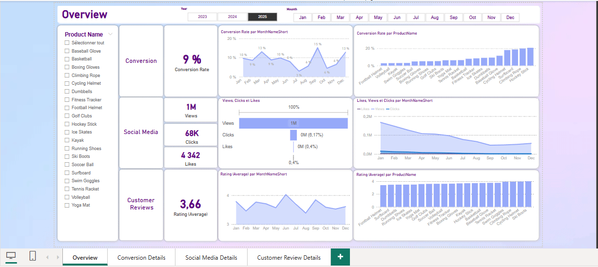

# **ShopEasy KPI Analysis and Objectives**

   

## **Introduction**
An e-commerce company, is facing a decline in customer engagement and conversion rates despite multiple marketing campaigns. The goal of this analysis is to identify limiting factors and optimize marketing strategies based on key performance indicators (KPIs).

## **📊 Key KPIs and objectives**

### **➡️ Increase Conversion Rate :** 
Determine the percentage of website visitors who complete a purchase.
- **Objective**: Identify friction points in the conversion funnel and propose improvements.
- **Analyse**: Optimize user journey, improve product pages, simplify checkout process.

### **➡️ Enhance Customer Engagement Rate :**
Determine the level of user interaction with marketing content (clicks, likes, comments).
- **Objective**: Identify the type of content that generates the most interactions and optimize it.
- **Analyse**: Adapt content strategy, test new formats (videos, influencers, etc.).

### **➡️ Average Order Value (AOV)**
Determine the average amount spent by a customer per transaction.
- **Objective**: Implement strategies to increase cart value.

### **➡️ Improve  Customer Satisfaction Score**
Determine the average rating of customer reviews on products and services.
- **Objective**: Identify strengths and weaknesses in customer feedback to enhance offerings.
- **Analyse**: Address recurring complaints, improve product and service quality.

## 📈**Results and actions to improvement strategies**

## 🧠 Skills Developed in the Project

- **Business Analysis & KPI Definition**
- **SQL**: Data Management (extraction, manipulation, optimization)
- **Power Query**: Data Cleaning and Transformation
- **Power BI**: Interactive Dashboards and Visuals Creation
- **Python** (NLTK, TextBlob): Sentiment Analysis from Customer Feedback
